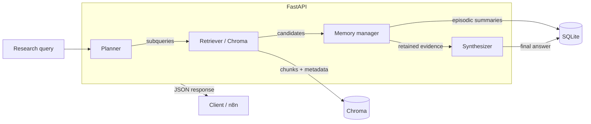
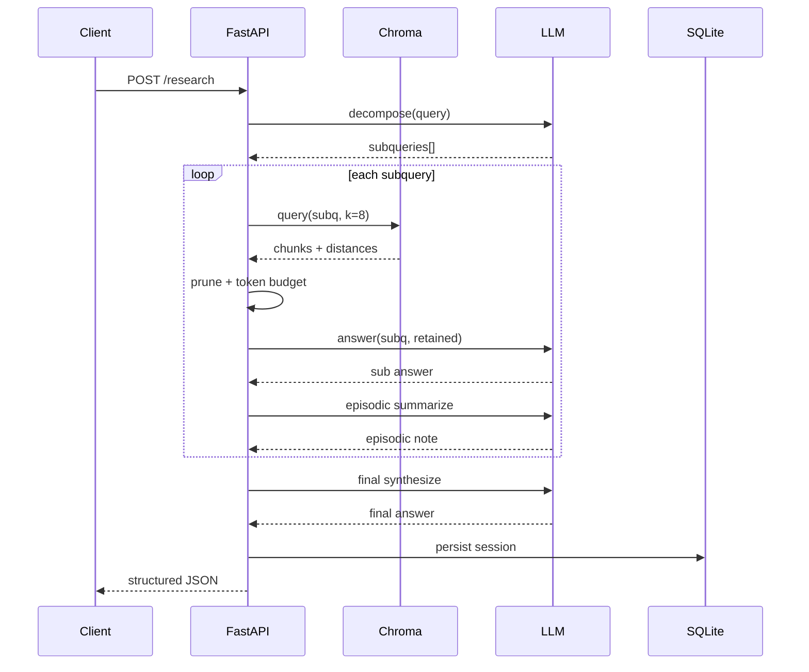

# Architecture — Deep Research Agent

## System overview

The service implements a **linear research pipeline** orchestrated in Python. External systems (e.g. **n8n**) should call the HTTP API; they do not embed business logic for decomposition, retrieval, or memory enforcement.

## Major components

| Component | Responsibility |
|-----------|----------------|
| `planner.py` | Emit ≤3 subqueries (LLM JSON + fallback) |
| `retriever.py` | Chunk corpus, index/query Chroma |
| `memory_manager.py` | Token estimate, dedupe, prune, discard reasons, episodic summary |
| `synthesizer.py` | Subquery answers + final synthesis |
| `grounded_synthesis.py` | Deterministic extractive answers when the mock provider is active |
| `llm.py` | Provider abstraction (`mock`, OpenAI, Anthropic) |
| `db.py` / `models.py` | SQLite persistence for sessions and memory actions |
| `evaluator.py` | Token/cost rollups, `SessionMetrics`, pipeline demonstration copy |

## Data flow

1. **Input**: `POST /research` with `query`.
2. **Plan**: Subqueries stored in memory and logged.
3. **Per subquery**:
   - Retrieve up to 8 chunks from Chroma.
   - Sort by score; remove near-duplicates.
   - Greedy pack into ≤4 chunks and ≤~2000 estimated tokens.
   - Produce subquery answer (LLM or grounded extractive summarizer) using **only** retained chunks.
   - Write episodic summary string to SQLite (and return in API).
4. **Synthesize**: Final answer from episodic summaries + short retained excerpts.
5. **Persist**: Full session row + subquery rows + memory action rows.

## Memory tiers (detail)

- **Working memory**: Ephemeral per subquery—**the literal text** passed into the LLM for that step.
- **Episodic memory**: **Compressed notes** per subquery suitable for later synthesis (not full sources).
- **Long-term memory**: **Vector-indexed chunks** in Chroma for retrieval; authoritative for “what existed in corpus.”

## Sequence of a research session

## When the memory limit is reached

1. **Chunk limit (4)**: Additional high-scoring chunks are discarded with reason **`chunk_limit`**.
2. **Token budget**: If the next chunk would push estimated tokens over budget, it is discarded with **`memory_limit`**.
3. **Duplicates**: Near-duplicate text is discarded with **`duplicate`**.
4. **Low relevance**: Chunks below a **relative score threshold** versus the top hit are discarded as **`low_relevance`**.

The HTTP response exposes discards as typed `discarded_chunks[]` on each `subquery_results[]` entry, plus a session-level `session_metrics.discard_breakdown` and plain-language `demonstration.*` strings so reviewers can see **capacity-bound** vs **relevance-bound** behavior quickly.

## n8n’s role

n8n provides **webhook ingress** and optional **operational wiring** (retries, notifications). It **does not** implement retrieval or memory logic—those remain in Python for clarity and tests.
